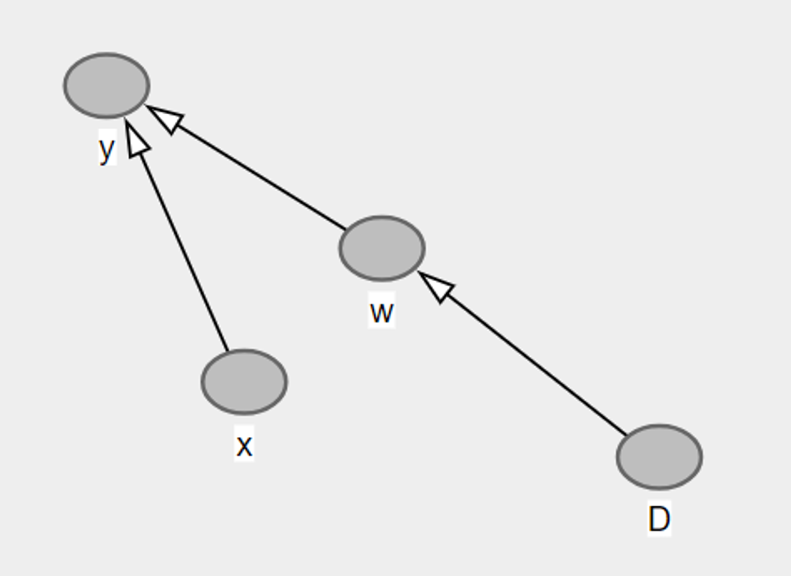
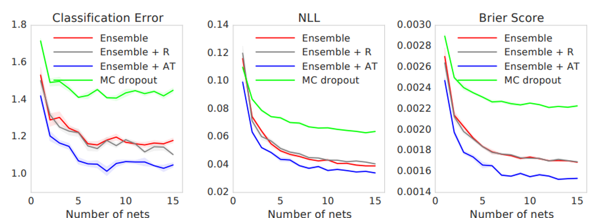
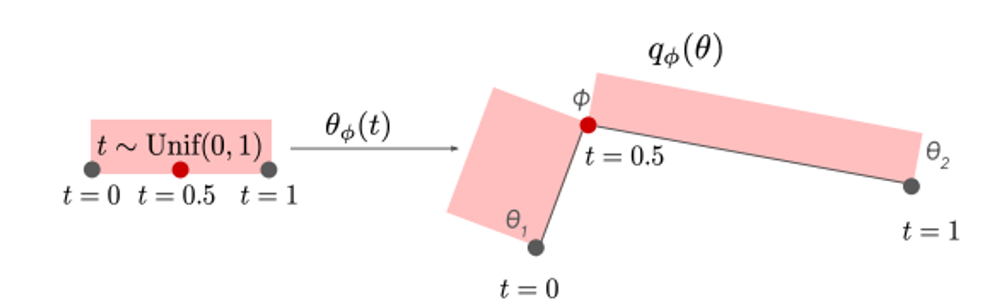
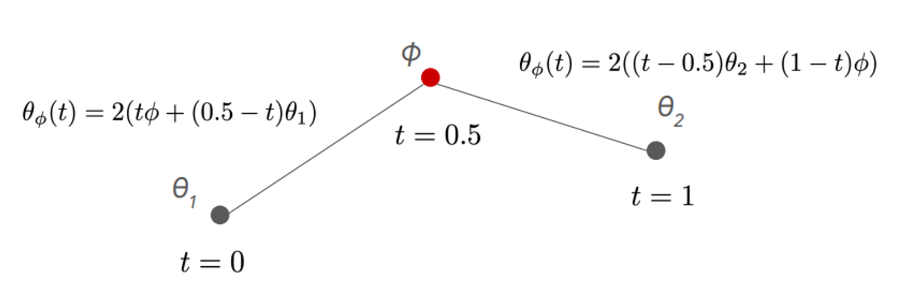

### Table of Contents
- [Bayesian Approach](#bayesian-approach)
- [Bayesian ML Approach #1: Ensemble](#bayesian-ml-approach-1-ensemble)
- [Bayesian ML Approach #2: Training Infinite Number of Models (Bayes by Backprop)](#bayesian-ml-approach-2-training-infinite-number-of-models-bayes-by-backprop)
- [Bayesian ML Approach #3: Dropout](#bayesian-ml-approach-3-dropout)
- [Bayesian ML Approach #4: Training a Curve of an Infinite Number of Models](#bayesian-ml-approach-4-training-a-curve-of-an-infinite-number-of-models)
- [Bayesian ML Approach #5: Stochastic Weight Averaging (SWAG)](#bayesian-ml-approach-5-stochastic-weight-averaging-swag)


## Bayesian Approach

What is the difference between *Deterministic ML* and *Bayesian ML*?

* Deterministic ML first optimizes a single model over the training set, $$\theta^*(\mathcal{D})$$ where $$\mathcal{D}$$ is the training data (a collection of $$(Y_i, X_i)$$). Then for a test sample, it predicts the label as follows:
    
    $$P(y \mid x, \mathcal{D}) = P(y \mid x, \theta^*(\mathcal{D}))$$ 
    
* We use only this single model to produce the output for input of interest. From the Bayesian perspective, this is equivalent to having a [Dirac](https://en.wikipedia.org/wiki/Dirac_delta_function) posterior.
* Epistemic uncertainty arises when the model encounters with a test sample that lies in the underexplored region (region that is not covered by the training dataset). In that case, we might have multiple plausible models. Since we only consider a single one in deterministic ML, we cannot represent epistemic uncertainty using deterministic ML.
* Different set of parameters maximizes the probability, meaning that there are more than one optimum models for the task - at least based on the given training set (epistemic uncertainty).


[//]: <> 


[//]: <> 
    

Bayesian ML finds a distribution of models: $$p(\theta \mid \mathcal{D})$$

Then the prediction for a specific test sample is made through **Bayesian Model Averaging** (BMA)/marginalization: 

$$P(y | x, \mathcal{D}) = \int{P(y | x, \theta) \; P(\theta | \mathcal{D}) \; d\theta} =  \mathbb{E}_{\theta \sim P(\theta|\mathcal{D})} P(y |x, \theta)$$

The idea can be simplified as follows: Let’s say there are $$3$$ different models (weights) with $$0.4, 0.4$$, and $$0.2$$ probabilities. Models output predicted probability as $$0.3, 0.25, 0.4$$ respectively. Then the expected predicted probability becomes: $$0.4 \times 0.3 + 0.4 \times 0.25 + 0.2 \times 0.4$$ = $$0.3$$.


---

Recipe:

1. Find a clever way to calculate (approximate) posterior distribution $$ p(\theta \mid \mathcal{D})$$. There are lots of ways listed below.
2. Using the posterior, get the prediction using **Bayesian Model Averaging.** Basically, we are calculating the expected value of the prediction based on the distribution $$\theta \sim p(\theta \mid \mathcal{D})$$. Here we can use **Monte Carlo Simulation** to calculate the expected value easily.
    
    $$P(y | x, \mathcal{D}) = \int{P(y | x, \theta) \; P(\theta | \mathcal{D}) \; d\theta} = \mathbb{E}_{\theta \sim P(\theta|\mathcal{D})} P(y |x, \theta)$$ 


---


Using Bayes' Theorem and marginalization, we know that $$p(a)=\int p(a,b)db$$. Using this equality, we can derive the following:

$$
\begin{split}
P(y | x, \mathcal{D}) &= \int P(y, \theta | x,  \mathcal{D}) d\theta  \\
&= \int P(y | \theta , x,  \mathcal{D}) P(\theta | x, \mathcal{D}) d\theta \\
 &= \int P(y | \theta , x) P(\theta | \mathcal{D}) d\theta \\
 &= \mathbb{E}_{\theta \sim P(\theta|\mathcal{D})} P(y |x, \theta)
\end{split}
$$


 [//]: <>    

<center>

</center>

Simple observations for the network:
* Test label $$y$$  is independent of the training data given the parameters $$w$$. That is, $$p(y, \mathcal{D} \mid w) = p(y \mid w) p(\mathcal{D} \mid w)$$ 

* $$w$$ is independent of the test input $$x$$. But be careful! It becomes dependent on it when the $$y$$ is given. You can think of it as two independent dice throws - where $$y$$ represents the event = sum of the throws is equal to 4. Without $$y$$, we know that the result of the first throw is independent of the result of the second throw. But if we know that $$y$$ is true or false, then the result of the first throw, then the result of the second throw becomes dependent on it.

## Bayesian ML Approach #1: Ensemble


So, we can utilize Bayesian ML to formulate epistemic uncertainty. Great,
but how can we produce the probability distribution $$P(\theta \mid D)$$? One way of doing it is using ensemble approach - where we train a model $$M$$  times with different random seeds. We can directly use the original training set or sample with replacement from it for each training. Here, we train several deterministic models. Therefore at the end, our distribution $$P(\theta \mid D)$$  simply becomes the sum of Dirac measures*.


Dirac measure, given a measurable space $$(\Omega, \mathcal{B})$$ and $$w \in \Omega$$, is a function $$\delta_w: \mathcal{B} \rightarrow \Omega$$, defined as follows:     

$$\delta_w(A) =  \begin{cases}
1, \; \text{if $\omega \in A$} \\
0, \; \text{if $\omega \notin A$}
\end{cases}$$


There is also the Dirac delta function (not formally a function) 


$$\delta(x)= \begin{cases} 
\infty, \; \text{if $x = 0$} \\
0, \; \text{if $x \neq 0$}
\end{cases}$$

The function $$δ(x)$$  has the value zero everywhere except at $$x = 0$$, where its value is infinitely large and is such that its total integral is $$1$$.

[Dirac function is commonly used to represent discrete probability distributions in a continuous way.](https://en.wikipedia.org/w/index.php?title=Probability_distribution#Dirac_delta_representation)

As a probability distribution, integral of the Dirac function over the whole domain gets equal to $$1$$.

$$\int_{-\infty}^\infty \delta(x) dx = 1$$

One final property that is extremely important is the following:

$$\int_{-\infty}^{\infty} f(x) \delta(x - c) \,dx = f(c)$$

There is a proof for this property [here](https://math.stackexchange.com/questions/73010/proof-of-dirac-deltas-sifting-property).


 [//]: <>  

When we train ensemble of $$M$$  models, we basically get the sum of Dirac measures as our probability distribution of the random variable $$\theta$$. Each Dirac measure is given as $$\delta(\theta - \theta_m)$$.

When we train ensemble of $$M$$  models, we basically get the sum of Dirac measures as our probability distribution of the random variable $$\theta$$. Each Dirac measure is given as $$\delta(\theta - \theta_m)$$.

$$P(\theta|D) = \frac{1}{M} \sum_m \delta(\theta - \theta_m)$$

- “Sum of diracs” should be a probability distribution, therefore its integral over real numbers must be equal to 1.
    
     $$
     \begin{split}
     &\int_{-\infty}^\infty \frac{1}{M} \sum_m \delta(\theta - \theta_m)d\theta \\ &= \frac{1}{M} \sum_m \int_{-\infty}^\infty \delta(\theta - \theta_m)d\theta \\&= \frac{1}{M} \sum_m \int_{-\infty}^\infty \delta(y)dy \\&=   \frac{1}{M} \sum_m  1 \\&= \frac{1}{M} M \\&= 1
     \end{split}$$ 
    
    Now, we can insert our posterior to the Bayesian Model Averaging:
    
    $$
    \begin{split} P(y \mid x, \mathcal{D}) &= \int{P(y \mid x, \theta) \; P(\theta \mid \mathcal{D}) \; d\theta} \\  \;\;\; \;\;\; \;\;\; \;\;\; \;\;\;\; &= \int{P(y \mid x, \theta) \; \frac{1}{M} \sum_m \delta(\theta - \theta_m)   \; d\theta}   \\  \;\;\; \;\;\; \;\;\; \;\;\; \;\;\;\; &= \frac{1}{M} \sum_m \int{P(y \mid x, \theta) \delta(\theta - \theta_m)   \; d\theta} \\  \;\;\; \;\;\; \;\;\; \;\;\; \;\;\;\; &= \frac{1}{M} \sum_m P(y \mid x, \theta_m)
    \end{split}$$
    
    So, as a result, we can get the prediction by taking the average of the resulting predictions from different models.
    
*  Pros
    - Conceptually simple - run training algorithm $$M$$ times.
    - Applicable to a wide range of models - from Linear Regression to LLMs
    - Embarrassingly parallel - easy to parallelize.
* Cons
    - Perhaps not realizing the full potential of Bayesian ML (only finite #models).
    - Space & time complexities scale linearly with $$M$$ (#models).
    

## Bayesian ML Approach #2: Training Infinite Number of Models (Bayes by Backprop)

Of course, it is not practically possible to train “infinite” number of models. But think about this: you can represent a probability distribution of infinite number of random variables with finite number of parameters (mean and variance). This is what we’ll try to do here. This approach called _Bayes by Backprop_ is first introduced in the paper [Weight Uncertainty in Neural Networks](https://arxiv.org/abs/1505.05424).

So, we can approximate $$P(\theta \mid \mathcal{D})$$ simply by a Gaussian distribution: 

 $$P(\theta \mid \mathcal{D}) \sim \mathcal{N}(\theta \mid \mu^*(\mathcal{D}), \Sigma^*(\mathcal{D}))$$ (Here since $$D$$ consists of all inputs, it is multivariate Gaussian)

However, we don’t really know if the posterior follows a Gaussian distribution. We can try to find the closest Gaussian distribution to the actual distribution of the posterior. We would like to minimize the distance between the two distributions. Which metric quantifies how much one probability distribution differs from another probability distribution? KL-Divergence!

$$\text{min}_{\mu, \Sigma} d(\mathcal{N}(\theta | \mu(\mathcal{D}), \Sigma(\mathcal{D})), p(\theta | \mathcal{D}))$$

Now, let’s derive the training objective. 

$$\text{KL}(\mathcal{N}(\theta \mid \mu, \Sigma) \; \Vert \; p(\theta \mid \mathcal{D})) = \int_{-\infty}^{\infty} \mathcal{N}(\theta \mid \mu, \Sigma) \log(\frac{\mathcal{N}(\theta \mid \mu, \Sigma)}{p(\theta \mid \mathcal{D})}) d\theta $$ 

First, let’s first deal with the denominator of natural logarithm.

$$p(\theta \mid \mathcal{D}) = \frac{p(\mathcal{D} \mid \theta) p(\theta)}{p(\mathcal{D})}$$  We can consider $$\ln(\frac{1}{p(\mathcal{D})}) = - \ln(p(\mathcal{D}))$$ as a constant.

$$= \int_{-\infty}^{\infty} \mathcal{N}(\theta | \mu, \Sigma) \log(\frac{\mathcal{N}(\theta | \mu, \Sigma)}{p(\mathcal{D} | \theta) p(\theta)}) + C_1$$

Let’s separate the logarithm:

$$ \begin{split} &= \int_{-\infty}^{\infty} \mathcal{N}(\theta \mid \mu, \Sigma) \log(\frac{\mathcal{N}(\theta \mid \mu, \Sigma)}{p(\theta)}) d\theta - \int_{-\infty}^{\infty} \mathcal{N}(\theta \mid \mu, \Sigma) \log(  p(\mathcal{D} \mid \theta)) d\theta + C_1 \\ &= \text{KL}(\mathcal{N}(\theta \mid \mu, \Sigma) \; || \; p(\theta)) -  \int_{-\infty}^{\infty} \mathcal{N}(\theta \mid \mu, \Sigma) \log(  p(\mathcal{D} \mid \theta)) d\theta + C_1\\ &= \text{KL}(\mathcal{N}(\theta \mid \mu, \Sigma) \; || \; p(\theta)) -  \mathbb{E}_{\theta \sim \mathcal{N}(\theta \mid \mu, \Sigma)} \log(p(\mathcal{D} \mid \theta)) + C_1
\end{split} $$

Ok so far so good, now assume that the input data is *identically independently distributed* (each $$(Y_i, X_i)$$ are independent from each other). We can represent $$p(\mathcal{D} \mid \theta)$$ as follows: $$p(\mathcal{D} \mid \theta) = \prod_{i} p(Y_i, X_i \mid \theta)$$ When you take the logarithm: $$\ln(p(\mathcal{D} \mid \theta)) = \sum_{i} \ln( p(Y_i, X_i \mid \theta))$$

Therefore the expectation reduces to the following:

$$\mathbb{E}_{\theta \sim \mathcal{N}(\theta \mid \mu, \Sigma)} \log(p(\mathcal{D}\mid \theta)) = \sum_i \mathbb{E}_{\theta \sim \mathcal{N}} \log( p(Y_i, X_i \mid \theta))$$

Let’s play with the probabilities here as well:

$$\begin{split}p(Y_i, X_i \mid \theta) &= \frac{p(Y_i, X_i, \theta)}{p(\theta)}\\ &=\frac{p(Y_i \mid X_i, \theta) p(X_i, \theta)}{p(\theta)} \\ &=  \frac{p(Y_i \mid X_i, \theta) p(X_i \mid \theta) p(\theta)}{p(\theta)} \\ &=  p(Y_i \mid X_i, \theta) p(X_i \mid \theta)\\ &= p(Y_i \mid X_i, \theta) p(X_i)\\ &= p(Y_i \mid X_i, \theta) \; C'\end{split}$$  

$$\theta$$ and $$X_i$$ are independent as long as $$Y_i$$ is not provided (if not convinced, please have a look at one of our previous observations). Now, insert this result to the previous expectation:

$$\begin{split} \sum_i \mathbb{E}_{\theta \sim \mathcal{N}} \log( p(Y_i \mid X_i, \theta) C')  &= \sum_i \mathbb{E}_{\theta \sim \mathcal{N}} \log( p(Y_i \mid X_i, \theta)) +  \underbrace{ \log(C')  \sum_i \mathbb{E}_{\theta \sim \mathcal{N}}[1]}_\textrm{$C_2$} \\ &= \sum_i \mathbb{E}_{\theta \sim \mathcal{N}}\log( p(Y_i \mid X_i, \theta)) + C_2 \end{split}$$

Expected value of a constant is equal to that constant.

Ok now, there is a method called **Monte Carlo Simulation.** Unnecessarily fancy name, but basically it says the following: To estimate the expected value of a function $$f(\theta)$$ under the distribution $$\theta \sim \mathcal{N}$$, simply just run the experiment $$K$$ times and take the average value of $$f(\theta)$$ over runs. We can approximate the last equation as follows with MC simulation:

$$\sum_i \mathbb{E}_{\theta \sim \mathcal{N}} \log( p(Y_i \mid X_i, \theta))  =   \sum_i \frac{1}{K} \sum_k  \log(p(Y_i \mid X_i, \theta_k))$$  where $$\theta_k \sim \mathcal{N}(\mu, \Sigma)$$ 

So, the final objective function becomes the following:

$$ min_{\mu, \Sigma} \; \text{KL}(\mathcal{N}(\theta \mid \mu, \Sigma) \; \Vert \; p(\theta)) - \frac{1}{K}  \sum_i \sum_k \log(p(Y_i \mid X_i, \theta_k)) + C$$ 

Right part can be calculated by simply running some experiments. For the left part, what is prior $$p(\theta)$$? This represents our initial idea as to the probability distribution for model parameters. Popular choice for the posterior is just a standard normal distribution: $$p(\theta) = \mathcal{N}(\vec{0}^{\,}, {I})$$ (multivariate)

Another observation here is that allowing a full covariance matrix $$\Sigma$$ can cause the computation to take extremely long (there are lots of possibilities). One trick is restricting the covariance matrix to be diagonal (independent features) $$\rightarrow \Sigma = \text{diag}(\sigma^2)$$ where $$\sigma^2$$ is the variance vector for each feature $$(\text{Var}[\theta^i])$$*. 

\* $$\theta_i$$ denotes the  $$i^{\text{th}}$$ set of parameters sampled from the Gaussian distribution. $$\theta^i$$ denotes the $$i^{\text{th}}$$ dimension of the vector of parameters.

$$\text{KL}(\mathcal{N}(\theta \mid \mu, \text{diag}(\sigma^2)) \; \Vert \; \mathcal{N}(\vec{0}^{\,}, {I})) = \int_{-\infty}^{\infty} \mathcal{N}(\theta \mid \mu, \text{diag}(\sigma^2))\log \left(\frac{\mathcal{N}(\theta \mid \mu, \text{diag}(\sigma^2))}{\mathcal{N}(\vec{0}^{\,}, {I})} \right) d\theta \\$$ 

So, this equation boils down to the following:

$$= \sum_i [\frac{\mu_i^2}{\sigma_i^2} + \log\sigma_i - \frac{1}{2}]$$  ⇒ this behaves like a regularizer for $$\mu$$ and $$\sigma$$

Multivariate Gaussian distribution for $$k$$ features ($$k$$ dimensional $$\theta$$ vector): 

$$\mathcal{N}(\mu, \Sigma) = (2\pi)^{-k/2} \text{det}(\Sigma)^{-1/2} \text{exp}(-\frac{1}{2} (x-\mu)^T \Sigma^{-1}(x - \mu))$$

for $$\mathcal{N}(\vec{0}^{\,}, {I}) = (2\pi)^{-k/2} \text{exp}(-\frac{1}{2}x^Tx)$$

$$min_{\mu, \Sigma} \;  \sum_i [\frac{\mu_i^2}{\sigma_i^2} + \log\sigma_i - \frac{1}{2}] - \frac{1}{K} \sum_i \sum_k \log(p(Y_i \mid X_i, \theta_k)) + C$$ where $$\theta_k \sim \mathcal{N}(\mu, \text{diag}(\sigma^2))$$ 

Now, our equations are still not Neural Network friendly - because we have to try to minimize a function that is not directly dependent on $$\mu$$ and $$\Sigma$$. We have to represent $$\theta$$  to include both $$\mu$$ and $$\Sigma$$. We can use the reparameterization here.


If $$X \sim \mathcal{N}(\mu, \sigma^2)$$, then $$Z = \frac{X - \mu}{\sigma} \sim \mathcal{N}(0, 1)$$
Since we set $$\Sigma$$ to be $$\text{diag}(\sigma^2)$$, all dimensions of the parameter vector $$\theta$$ are independent of each other. Individually $$\theta^i \sim \mathcal{N}(\mu_i, \sigma_i^2)$$ - 1D Gaussian random variable. Therefore we can perform the given parameterization trick.


$$\theta = \mu + \sigma \odot \epsilon$$ where $$\odot$$ is the pointwise multiplication and $$\epsilon \sim \mathcal{N}(\vec{0}^{\,}, {I})$$

This reparameterization makes the backpropagation extremely simple:

$$\frac{\partial \mathcal{L}}{\partial \mu_i} = \sum_j \frac{\partial \mathcal{L}}{\partial \theta_j} \frac{\partial \theta_j}{\partial \mu_i}  = \frac{\partial \mathcal{L}}{\partial \theta_i}$$ 

$$\frac{\partial \mathcal{L}}{\partial \sigma_i} = \sum_j \frac{\partial \mathcal{L}}{\partial \theta_j} \frac{\partial \theta_j}{\partial \sigma_i} = \epsilon_i \frac{\partial \mathcal{L}}{\partial \theta_i}$$

Usually we set $$K$$ to $$1$$, that is, we only sample one $$\theta$$ from the distribution **in each iteration**. Then the second term simply becomes the cross-entropy loss:

$$ \sum_i  \log(p(Y_i \mid X_i, \theta))$$ is the total loss using Cross Entropy. There is one single addition we have to do: Averaging

$$\frac{1}{N} \sum_i \log(p(Y_i \mid X_i, \theta))$$ calculates the cross entropy loss ($$P(Y_i) = 1$$) for a batch of $$(Y_i, X_i)$$  pairs.

One final note: Standard deviation $$\sigma$$ is the square root of variance $$\sigma^2$$ and therefore it must be non-negative. However, PyTorch doesn’t know this and it might produce negative $$\sigma$$ as a result of the backpropagation. We can define another function for $$\sigma$$ with an input allowed to be negative:

$$\sigma = \ln(1+e^\rho)$$ (softplus - $$\sigma$$ is always non-negative, let the model update the value of $$\rho$$)

PyTorch code for “Training Infinite Number of Models” ($$K$$ is set to $$1$$, therefore only one $$\epsilon$$ is created):

```python
class BayesBackpropLinear(nn.Module):
    def __init__(self, in_dim, out_dim):
        super(BayesBackpropLinear, self).__init__()
        self.mu = nn.Parameter(torch.Tensor(in_dim, out_dim).uniform_(-0.2, 0.2))
        self.rho = nn.Parameter(torch.Tensor(in_dim, out_dim).uniform_(-3, -2))

    def forward(self, x):
        eps = torch.randn(self.mu.shape)
        sigma = F.softplus(self.rho)
        theta = self.mu + sigma * eps
        return torch.mm(x, theta)

    def compute_loss(self, logits, targets):
        log_likelihood = F.cross_entropy(logits, targets, reduction="mean")
        sigma = F.softplus(self.rho)
        kl_prior = torch.sum(self.mu**2 / sigma**2 - torch.log(sigma) - 0.5)
        return log_likelihood + kl_prior
```
  [//]: <> 

In the forward function, we multiply $$\theta$$ with $$x$$. Here the idea is to mimic a shallow NN consisting of input and output layers. Result of the multiplication gives us the logits (activation must be applied to get the predicted probabilities) The main idea here is this: Rather than training one parameter set $$\theta$$ over each iteration, we train parameters $$\mu$$ and $$\sigma$$ that will generate infinitely many $$\theta$$ → Bayes ML
In the forward function, we multiply $$\theta$$ with $$x$$. Here the idea is to mimic a shallow NN consisting of input and output layers. Result of the multiplication gives us the logits (activation must be applied to get the predicted probabilities) The main idea in this code is this: Rather than training one parameter set $$\theta$$ over each iteration, we train parameters $$\mu$$ and $$\sigma$$ that will generate infinitely many $$\theta$$ → Bayes ML.

As a result of this model, we will get $$\mu^*$$ and  $$\Sigma^*$$ that minimizes the $$\text{KL}(\mathcal{N}(\theta \mid \mu(\mathcal{D}), \Sigma(\mathcal{D})), p(\theta \mid \mathcal{D}))$$ where $$P(\theta \mid \mathcal{D}) \sim \mathcal{N}(\theta \mid \mu^*(\mathcal{D}), \Sigma^*(\mathcal{D}))$$

What remains is the application of BMA. Calculate the expected value of $$P(y \mid x, \theta)$$ using the $$\theta$$ sampled from $$\mathcal{N}(\theta \mid \mu^*(\mathcal{D}), \Sigma^*(\mathcal{D}))$$ using the learned mean and variance.

$$P(y | x, \mathcal{D}) = \int{P(y | x, \theta) \; P(\theta | \mathcal{D}) \; d\theta} = \mathbb{E}_{P(\theta|D)} P(y |x, \theta)$$

## Bayesian ML Approach #3: Dropout

On the spectrum of Bayesian methods, dropout is between the sum of Diracs (training a few deterministic ML models) and the variational approach (that trains an infinite number of models). 

Dropout is randomly applied to the model **for each iteration.** Considering the Cross Entropy Loss, objective function of the model can be formulated as follows:

$$-\frac{1}{N}\sum_{n=1}^{N}\log P(y_n \mid x_n, s \odot \theta)$$ where we turn on/off each weight dimension randomly in each iteration: $$s_i \sim \text{Bernouilli}( p)$$ where $$p$$ is the dropout rate. Dropout is something that people used to use a lot → Bayesian NN for free.

Now, here is the idea: Normally, we train models with dropouts and then close the dropout at inference time (test time). Here, we can still apply dropout to have different models make predictions during test time. Again, we apply Bayesian Model Averaging with Monte Carlo estimation for the integral. 

$$\begin{split}P(y \mid x, \mathcal{D}) &= \int{P(y \mid x, \theta) \; P(\theta \mid \mathcal{D}) \; d\theta} \\  &= \mathbb{E}_{\theta \sim P(\theta \mid D)} P(y \mid x, \theta) \\ &\approx \frac{1}{K} \sum_{k=1}^K P(y \mid x, \theta_{k})  \;\; \text{where} \;\; \theta_{k} = s_k \odot \theta \end{split}$$

There are $$K$$ models to compare with each other. We expect to have disagreements between the models for OOD samples, and therefore measure the epistemic uncertainty. 

Problem: Unfortunately, this method doesn’t work that well in practice as shown in the paper [Simple and Scalable Predictive Uncertainty Estimation using Deep Ensembles](https://arxiv.org/abs/1612.01474).

  [//]: <>  
<center>

</center>


## Bayesian ML Approach #4: Training a Curve of an Infinite Number of Models

This idea makes the following assumption: If you train two models independently, you get two different $$\theta_i$$ weights that are far away from each other in the space. But from one to another, there is a path where the loss value is always low. So we can find the weights in between to have infinite number of models. 

This is also Bayesian, as we are training an infinite number of models according to a learned parametric approximate posterior.

Here is the algorithm to train a curve of infinite number of models:

1. Train two independent models: $$\theta_1$$ and $$\theta_2$$
2. Parameterize the curve via a third model $$\phi$$. There are two line segments between the models.

  [//]: <> 

$$\theta_{\phi}(t) = \begin{cases}  2(t\phi + (0.5-t)\theta_1)\;\;\;\;\;\;\;\;\;\;\;\;\;\text{if}\; t \in [0, 0.5) \\ 2((t - 0.5)\theta_2 + (1-t)\phi) \;\;\;\; \text{if} \; t \in [0.5, 1] \end{cases}$$

  [//]: <> 

$$\theta_1$$ and $$\theta_2$$ are already known, we just have to find $$\phi$$ so that the any model on the curve has low training loss. So, we actually have to minimize the expected value of the cross entropy loss:

$$\text{min}_\phi \;\mathbb{E}_{\theta \sim q_{\phi}(\theta)} \left[ -\frac{1}{N} \sum_n \log P(y_n \mid x_n, \theta) \right]$$  → find a suitable $$\phi$$ under the expectation of both $$\theta$$ and $$X, Y$$

Using the reparameterization trick:

$$\text{min}_\phi \;\mathbb{E}_{t \sim \text{Unif}[0, 1]}\left[ -\frac{1}{N} \sum_n \log P(y_n | x_n, \theta_{\phi}(t)) \right]$$

This minimization aims to minimize the cross entropy loss by finding a suitable $$\phi$$.

> A general observation ([Loss Surfaces, Mode Connectivity, and Fast Ensembling of DNNs](https://arxiv.org/pdf/1802.10026.pdf)) is that almost all pairs of independently trained models ($$\theta_1, \theta_2$$) for DNNs are connected through a third point $$\phi$$ in a low-loss “highway” that we can easily find. This gives an interesting intuition for the loss landscape: Most solutions in the DL landscape are connected by some piecewise linear curve. This is not so surprising: We have millions/billions of dimensions to choose from. We can likely find a 2D cut of the loss in which there exists a parametric curve parameterized by $$\phi$$  that connects the two endpoints with a low training loss.
> 

After training the model and finding a suitable $$\phi$$, the rest is using the **Bayesian Model Averaging** by sampling models (weights) from the curve between $$\theta_1$$ and $$\theta_2$$:

$$\begin{split} P(y \mid x, \mathcal{D}) &= \int{P(y \mid x, \theta) \; P(\theta \mid \mathcal{D}) \; d\theta} \\ &= \mathbb{E}_{\theta \sim P(\theta|D)} P(y \mid x, \theta) \\ &\approx \frac{1}{K} \sum_{k=1}^K P(y | x, \theta_\phi{(t^{(k)})}) \;\; \text{where} \;\; t^{(k)} \sim   \text{Unif}[0, 1] \end{split}$$

## Bayesian ML Approach #5: Stochastic Weight Averaging (SWAG)

Lastly, we can exploit the randomness in SGD as a cheap source for Bayesian ML. Because of small batches (usually batch size = 1), SGD trajectory is very noisy. The training’s final few iterations (epochs) can be treated as samples from the approximate posterior distribution $$p(\theta \mid \mathcal{D})$$. 

  [//]: <> 

We would like to approximate the last iterations with Gaussian:

$$p(\theta | \mathcal{D}) \sim \mathcal{N}(\theta | \mu(\mathcal{D}), \Sigma(\mathcal{D}))$$

We assume that last $$\theta_i$$ values are coming from a Gaussian distribution. We want to find the mean and the covariance matrix for it. We can use the sample estimates basically:

$$\mu = \frac{1}{L} \sum_l \theta_l$$

$$\Sigma = \text{diag} \left(  \frac{1}{L} \sum_l \theta_l^2 - (\frac{1}{L} \sum_l \theta_l)^2 \right)$$ assuming that the different features $$\theta_i$$  and $$\theta_j \; (i \neq j)$$ are not correlated with each other. 

SWAG is not so scalable because it requires the full empirical covariance matrix. On the other hand SWAG-Diag can be used to reduce the time complexity. However, according to the benchmark results, it seems that SWAG-Diag only scales better computationally, but the results do not follow.

After getting the $$p(\theta \mid \mathcal{D})$$, rest is similar to what we have done so far:

1. Using the posterior, get the prediction using **Bayesian Model Averaging**. Basically, we are calculating the expected value of the prediction based on the distribution $$\theta \sim p(\theta \mid \mathcal{D})$$.
    
    $$P(y | x, \mathcal{D}) = \int{P(y | x, \theta) \; P(\theta | \mathcal{D}) \; d\theta} = \mathbb{E}_{\theta \sim P(\theta|\mathcal{D})} P(y |x, \theta)$$ 
    
2. To approximate the epistemic uncertainty, either calculate the entropy $$\mathbb{H}(P(y \mid x, \mathcal{D}))$$ or the max-prob for classification $$\text{max}_k P(Y = k \mid x, \mathcal{D})$$.

---

**Conclusion**: There are strong assumptions for these Bayesian approaches to work:

- We should have a reasonable prior for the parameters $$\theta$$.
- The posterior follows the assumed distribution (e.g., a Gaussian). Of course, the posterior will seldom be truly Gaussian. This is a huge assumption.

---
**References:** Bálint Mucsányi, Michael Kirchhof, Elisa Nguyen, Alexander Rubinstein, Seong Joon Oh (2023): "Proper/Strictly Proper Scoring Rule"; in: Trustworthy Machine Learning; URL: https://trustworthyml.io/; DOI: 10.48550/arXiv.2310.08215.